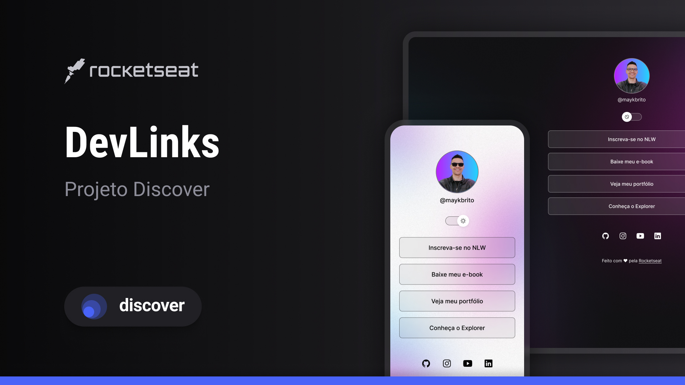

<h1 align="center"> DevLinks </h1>

Programa exclusivo e gratuito, promovido pela Rocketseat para ensino de tecnologias WEB.

  <a href="#-tecnologias">Tecnologias</a>&nbsp;&nbsp;&nbsp;|&nbsp;&nbsp;&nbsp;
  <a href="#-projeto">Projeto</a>&nbsp;&nbsp;&nbsp;|&nbsp;&nbsp;&nbsp;
  <a href="#-layout">Layout</a>&nbsp;&nbsp;&nbsp;|&nbsp;&nbsp;&nbsp;
  <a href="#memo-licença">Licença</a>

  

## 🚀 Tecnologias

Esse projeto foi desenvolvido com as seguintes tecnologias:

- HTML e CSS
- JavaScript
- Git e Github
- figma

## 💻 Projeto

O DevLinks é um agregador de links para usar cmo cartão de visitas

## 🔖 Layout

Você pode visualizar o layout do projeto através [DESSE LINK]([https://www.figma.com/file/J1Z33MISC22YZB8wfxiIns/NLW-Copa-Explorer/duplicate](https://www.figma.com/design/wPlIU92218YHaluaRlG0LS/DevLinks-•-Projeto-Discover--Community-?node-id=0-1&p=f&t=03pNuk4YCY5wZZqA-0)). É necessário ter conta no [Figma](https://figma.com) para acessá-lo.

## :memo: Licença

Esse projeto está sob a licença MIT.

## 🧠 Aprendizado

Durante o desenvolvimento deste projeto, aprendi e pratiquei diversos conceitos importantes, como:

- Estruturação de páginas com HTML

- Estilização e uso de variáveis no CSS

- Manipulação da DOM com JavaScript

- Implementação de modo dark/light

- Uso do localStorage para salvar preferências

- Versionamento de código com Git e envio para o GitHub

- Organização de pastas e arquivos no front-end

- Leitura e aplicação de layout a partir do Figma

---

Feito com ♥ by Rocketseat :wave: [Participe da nossa comunidade!](https://discord.gg/rocketseat)
